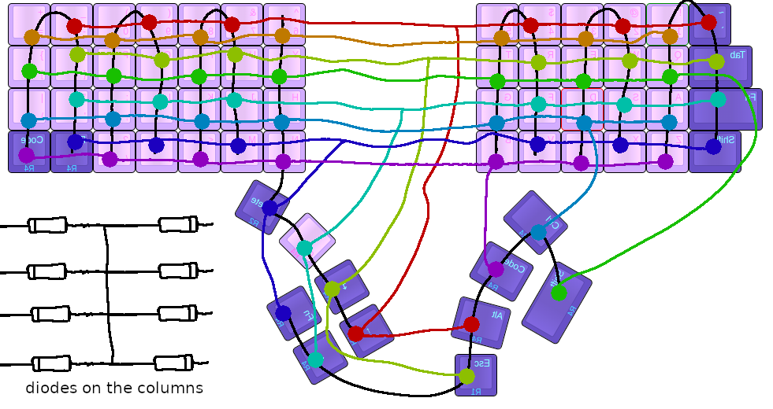

## Use with an Adafruit Feather nRF52840 Express

See the `bt_dactyl.overlay` file for the correct pinouts for rows and columns.

Build with
`west build -p -d build/purple_dactyl -b adafruit_feather_nrf52840 -- -DSHIELD=bt_dactyl`

## Wiring for the "Purple Dactyl"

### Matrix image created by Reddit user [TeXitoi](https://www.reddit.com/user/TeXitoi/) as a gracious response to one of my questions

The matrix for this Dactyl Manuform is 100% custom due to the design decision of only using one micro controller, and only having 17 available GPIOs to use. TeXitoi was able to show me how to loop the columns around so two columns of switches share one IO column, and every row of switches skips every other switch. This allows the use of only 16 pins (8 rows, and 8 columns), leaving one free for RGB or something else. I have flipped the image here for easier assembly when the keyboard is facing belly up.

The columns are wired to pins 12 through 2; left to right (yes, in reverse order).

#### The columns are wired as (viewing from underside)

|Column Pin | Column Number |
|--------|------------------|
| 12     | 1 (left half)    |
| 11     | 2 (left half)    |
| 10     | 3 (left half)    |
| 9      | 4 (left half)    |
| 6      | 5 (both)         |
| 5      | 6 (right half)   |
| 3      | 7 (right half)   |
| 2      | 8 (right half)   |

#### The rows are wired as (viewing from underside)

|Row Pin | Color        |
|--------|--------------|
| A0     | orange       |
| A1     | red          |
| A2     | green        |
| A3     | lime green   |
| A4     | light blue   |
| A5     | teal         |
| 0      | purple       |
| 1      | blue         |